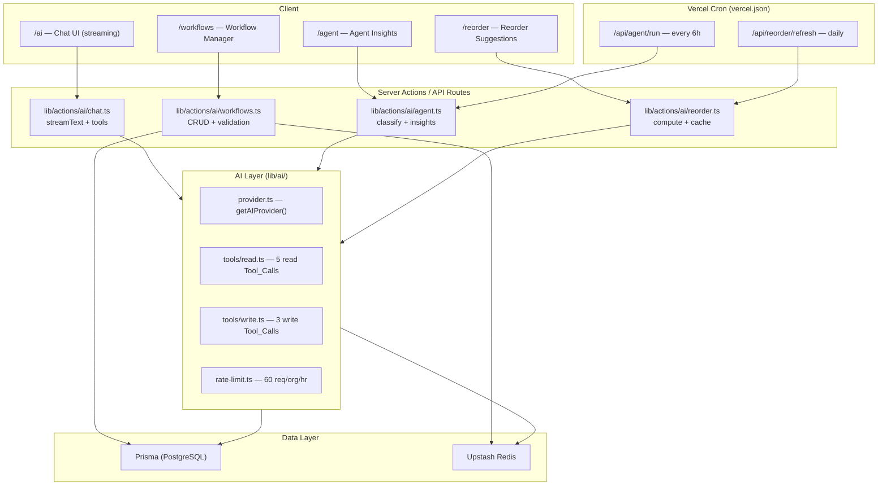
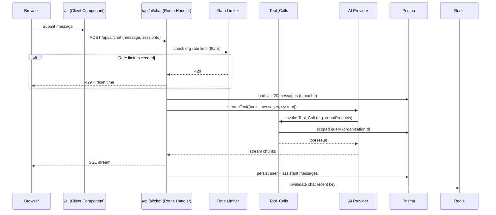
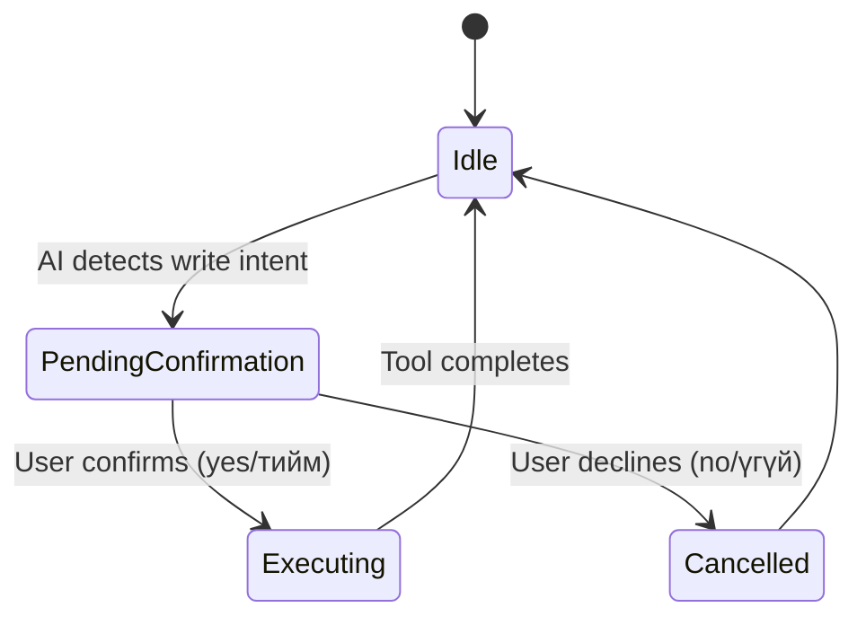

# Design Document: AI Agent Workflow

## Overview

This document describes the technical design for the AI Agent Workflow feature in StockFlow. The feature adds four interconnected AI-powered capabilities on top of the existing Next.js 15 / Prisma / Redis / Stack Auth stack:

1. **AI Assistant Chat Interface** (`/ai`) — natural-language inventory queries in English and Mongolian, with write operations (create/update/delete product) for MANAGER+ roles, streamed via Vercel AI SDK.
2. **Automated Workflow Engine** (`/workflows`) — user-defined Trigger → Condition → Action rules evaluated on inventory events and cron schedules.
3. **Reorder Suggestion Engine** (`/reorder`) — consumption-based stockout prediction with AI-generated explanations.
4. **Autonomous AI Agent** (`/agent`) — background job that scans inventory every 6 hours, classifies anomalies by severity, and surfaces Agent Insights.

All features are org-scoped, follow the existing `org:{id}:*` Redis cache namespace, use `getOrgContext()` for authentication, Prisma for persistence, and Server Actions for mutations. The AI layer integrates with OpenAI or Anthropic via the Vercel AI SDK (`ai` package).

---

## Architecture

### High-Level Component Map



### Request Flow: Chat Message



---

## Components and Interfaces

### AI Provider Factory (`lib/ai/provider.ts`)

Reads `AI_PROVIDER`, `OPENAI_API_KEY`, `ANTHROPIC_API_KEY` from environment. Returns a Vercel AI SDK model instance. Throws a descriptive error at startup if the required key is missing.

```typescript
// lib/ai/provider.ts
import { createOpenAI } from "@ai-sdk/openai";
import { createAnthropic } from "@ai-sdk/anthropic";

export function getAIModel() {
  const provider = process.env.AI_PROVIDER ?? "openai";
  if (provider === "anthropic") {
    if (!process.env.ANTHROPIC_API_KEY)
      throw new Error("ANTHROPIC_API_KEY is required when AI_PROVIDER=anthropic");
    return createAnthropic()("claude-3-5-sonnet-20241022");
  }
  if (provider !== "openai") {
    console.warn(`[AI] Unknown AI_PROVIDER="${provider}", defaulting to openai`);
  }
  if (!process.env.OPENAI_API_KEY)
    throw new Error("OPENAI_API_KEY is required when AI_PROVIDER=openai");
  return createOpenAI()("gpt-4o");
}
```

### Read Tool_Calls (`lib/ai/tools/read.ts`)

Five tools registered with the Vercel AI SDK `tool()` helper. All inputs validated with Zod. All queries scoped to `organizationId`.

| Tool | Input Schema | Returns |
|---|---|---|
| `countProducts` | `{ nameFilter?: string }` | `{ count: number }` |
| `listLowStockProducts` | `{}` | `Product[]` (name, sku, qty, threshold) |
| `getProductByName` | `{ name: string }` | `Product \| null` |
| `listTopValueProducts` | `{ limit: number (1–50) }` | `Product[]` sorted by price×qty desc |
| `getInventorySummary` | `{}` | `{ totalSKUs, totalValue, lowStockCount, outOfStockCount }` |

### Write Tool_Calls (`lib/ai/tools/write.ts`)

Three tools available only when the requesting member has `MANAGER` or `SUPER_ADMIN` role. Role is checked inside each tool before any DB mutation. Each tool calls `writeAuditLog` and invalidates `org:{id}:dashboard` and `org:{id}:inventory:*` cache keys.

| Tool | Input Schema | Side Effects |
|---|---|---|
| `createProduct` | `{ name: string (min 1), quantity: number (≥0, int), price: number (≥0) }` | Creates Product, writes AuditLog, invalidates cache |
| `updateProduct` | `{ name: string, updates: { name?, quantity?, price? } }` | Updates Product by name, writes AuditLog, invalidates cache |
| `deleteProduct` | `{ name: string }` | Deletes Product by name, writes AuditLog, invalidates cache |

### Confirmation State Machine (Chat UI)

Write operations require a two-step confirmation in the chat UI before the tool executes. The AI model is instructed via system prompt to always present a confirmation message and wait for explicit user approval before invoking a write tool.



The system prompt instructs the model to:
1. Detect write intent from the user message.
2. Respond with a confirmation question in the same language as the query.
3. Only invoke the write tool after receiving explicit confirmation.

### Chat API Route (`app/api/ai/chat/route.ts`)

- `POST /api/ai/chat` — accepts `{ message: string, sessionId?: string }`.
- Calls `getOrgContext()` for auth and org scoping.
- Checks rate limit via `lib/rate-limit.ts` (60 req/org/hr using Upstash).
- Loads last 20 messages from cache or DB.
- Calls `streamText()` with read tools (always) + write tools (MANAGER+ only).
- Streams response back as SSE.
- Persists user + assistant messages to DB after stream completes.
- Invalidates `org:{id}:member:{memberId}:chat:recent`.

### Workflow Engine (`lib/actions/ai/workflows.ts`)

Server Actions for CRUD on `WorkflowRule`. Validation uses Zod + `cron-parser` for cron expressions. The engine evaluates rules in two contexts:

- **Event-driven**: called from `maybeCreateAlerts()` and product mutation actions when quantity changes.
- **Cron-driven**: called from `/api/workflows/run` (Vercel Cron or manual trigger).

### Reorder Engine (`lib/actions/ai/reorder.ts`)

- Reads `ConsumptionRecord` for the last 30 days per product.
- Computes `dailyRate = totalConsumed / 30`.
- Skips products with fewer than 3 records.
- Computes `daysUntilStockout = floor(currentQty / dailyRate)`.
- Generates `ReorderSuggestion` for products where `daysUntilStockout <= 14`.
- Calls AI provider to generate a natural-language explanation per suggestion (cached per product).

### Autonomous Agent (`lib/actions/ai/agent.ts`)

- Triggered by `POST /api/agent/run` (protected by `CRON_SECRET` header).
- Scans all products in the org.
- Evaluates three conditions: stockout within 7 days, anomaly spike >50%, dead stock >30 days.
- Classifies severity per Requirement 9.
- Calls AI provider for natural-language descriptions (falls back to rule-based text if provider unavailable).
- Persists `AgentInsight` records and an `AgentRun` log entry.

---

## Data Models

New Prisma models to add to `prisma/schema.prisma`. All include a non-nullable `organizationId` with cascade delete.

### New Enums

```prisma
enum WorkflowTriggerType {
  QUANTITY_BELOW
  QUANTITY_ABOVE
  CRON_SCHEDULE
  ANOMALY_DETECTED
}

enum WorkflowActionType {
  SEND_EMAIL
  CREATE_ALERT
  GENERATE_REPORT
  WEBHOOK
}

enum WorkflowRunStatus {
  SUCCESS
  FAILURE
}

enum ConditionResult {
  TRUE
  FALSE
  SKIPPED
}

enum InsightType {
  STOCKOUT_RISK
  ANOMALY_SPIKE
  DEAD_STOCK
}

enum InsightSeverity {
  LOW
  MEDIUM
  HIGH
}

enum AgentRunStatus {
  SUCCESS
  FAILURE
}
```

### New Models

```prisma
model ChatSession {
  id             String        @id @default(cuid())
  organizationId String
  memberId       String
  createdAt      DateTime      @default(now())
  updatedAt      DateTime      @updatedAt

  organization   Organization  @relation(fields: [organizationId], references: [id], onDelete: Cascade)
  messages       ChatMessage[]

  @@index([organizationId, memberId])
}

model ChatMessage {
  id            String      @id @default(cuid())
  sessionId     String
  organizationId String
  role          String      // "user" | "assistant"
  content       String      @db.Text
  createdAt     DateTime    @default(now())

  session       ChatSession @relation(fields: [sessionId], references: [id], onDelete: Cascade)
  organization  Organization @relation(fields: [organizationId], references: [id], onDelete: Cascade)

  @@index([sessionId, createdAt])
  @@index([organizationId])
}

model WorkflowRule {
  id             String               @id @default(cuid())
  organizationId String
  name           String
  triggerType    WorkflowTriggerType
  triggerConfig  Json                 // { threshold?, cronExpression?, productId? }
  conditionExpr  String?              // optional filter expression
  actionType     WorkflowActionType
  actionConfig   Json                 // { email?, url?, payload?, alertType? }
  enabled        Boolean              @default(true)
  createdAt      DateTime             @default(now())
  updatedAt      DateTime             @updatedAt

  organization   Organization         @relation(fields: [organizationId], references: [id], onDelete: Cascade)
  runs           WorkflowRun[]

  @@index([organizationId, enabled])
}

model WorkflowRun {
  id               String          @id @default(cuid())
  organizationId   String
  workflowRuleId   String
  triggeredAt      DateTime        @default(now())
  conditionResult  ConditionResult
  actionType       WorkflowActionType
  status           WorkflowRunStatus
  errorMessage     String?

  organization     Organization    @relation(fields: [organizationId], references: [id], onDelete: Cascade)
  workflowRule     WorkflowRule    @relation(fields: [workflowRuleId], references: [id], onDelete: Cascade)

  @@index([organizationId, workflowRuleId])
  @@index([organizationId, triggeredAt(sort: Desc)])
}

model ConsumptionRecord {
  id             String       @id @default(cuid())
  organizationId String
  productId      String
  quantityBefore Int
  quantityAfter  Int
  consumed       Int          // quantityBefore - quantityAfter
  recordedAt     DateTime     @default(now())

  organization   Organization @relation(fields: [organizationId], references: [id], onDelete: Cascade)

  @@index([organizationId, productId, recordedAt])
}

model ReorderSuggestion {
  id                   String       @id @default(cuid())
  organizationId       String
  productId            String
  productName          String
  currentQuantity      Int
  dailyConsumptionRate Float
  daysUntilStockout    Int
  suggestedReorderQty  Int
  aiExplanation        String?      @db.Text
  generatedAt          DateTime     @default(now())

  organization         Organization @relation(fields: [organizationId], references: [id], onDelete: Cascade)

  @@index([organizationId, daysUntilStockout])
}

model AgentInsight {
  id             String          @id @default(cuid())
  organizationId String
  insightType    InsightType
  productId      String
  productName    String
  description    String          @db.Text
  severity       InsightSeverity
  resolved       Boolean         @default(false)
  resolvedById   String?
  resolvedAt     DateTime?
  generatedAt    DateTime        @default(now())

  organization   Organization    @relation(fields: [organizationId], references: [id], onDelete: Cascade)

  @@index([organizationId, resolved, severity])
  @@index([organizationId, generatedAt(sort: Desc)])
}

model AgentRun {
  id               String         @id @default(cuid())
  organizationId   String
  startedAt        DateTime       @default(now())
  completedAt      DateTime?
  insightsGenerated Int           @default(0)
  status           AgentRunStatus
  errorMessage     String?

  organization     Organization   @relation(fields: [organizationId], references: [id], onDelete: Cascade)

  @@index([organizationId, startedAt(sort: Desc)])
}
```

### Cache Key Reference

| Key Pattern | TTL | Invalidated By |
|---|---|---|
| `org:{id}:member:{mid}:chat:recent` | 300s | New message persisted |
| `org:{id}:reorder:suggestions` | 3600s | Product quantity update |
| `org:{id}:reorder:explanation:{productId}` | 3600s | Reorder refresh job |
| `org:{id}:agent:insights` | 3600s | Insight resolved, agent run |
| `org:{id}:dashboard` | 300s | Write Tool_Call success |
| `org:{id}:inventory:*` | 60s | Write Tool_Call success |

### Vercel Cron Updates (`vercel.json`)

```json
{
  "regions": ["hnd1"],
  "crons": [
    { "path": "/api/digest/run",      "schedule": "0 1 * * *" },
    { "path": "/api/agent/run",       "schedule": "0 */6 * * *" },
    { "path": "/api/reorder/refresh", "schedule": "0 2 * * *" }
  ]
}
```

---

## Correctness Properties

*A property is a characteristic or behavior that should hold true across all valid executions of a system — essentially, a formal statement about what the system should do. Properties serve as the bridge between human-readable specifications and machine-verifiable correctness guarantees.*

Property-based testing is applicable here because the feature contains pure functions (rate computation, severity classification, validation logic, tool idempotence) with large input spaces where 100+ iterations meaningfully increase confidence. The chosen PBT library is **fast-check** (TypeScript-native, works with Jest/Vitest).

### Property 1: Tool_Call Idempotence

*For any* valid Tool_Call input and an unchanged database state, executing the same read Tool_Call twice SHALL return equivalent results.

**Validates: Requirements 2.6**

### Property 2: Tool_Call Org Isolation

*For any* Tool_Call executed in the context of Organization A, the returned results SHALL contain only data belonging to Organization A and never data from any other Organization.

**Validates: Requirements 1.6, 2.2, 11.2**

### Property 3: Chat Message Persistence Round-Trip

*For any* user message submitted to the chat interface, after the response is received, querying the chat session history SHALL return a message record with the same content, role, and a valid timestamp.

**Validates: Requirements 1.8, 3.1, 3.3**

### Property 4: Chat History Bounded at 20

*For any* chat session containing N messages (N ≥ 0), loading the chat interface SHALL return exactly min(N, 20) messages, ordered by creation timestamp descending.

**Validates: Requirements 1.9**

### Property 5: Rate Limit Enforcement

*For any* Organization, after exactly 60 AI Assistant requests within a single hour window, the 61st request SHALL receive an HTTP 429 response containing a reset timestamp.

**Validates: Requirements 1.11**

### Property 6: Cron Expression Validation Round-Trip

*For any* syntactically valid cron expression, the Workflow_Rule_Validator SHALL accept it; *for any* syntactically invalid cron expression, the validator SHALL reject it with a descriptive error.

**Validates: Requirements 5.2, 5.6**

### Property 7: Workflow Validation Rejects Invalid Inputs

*For any* Workflow_Rule submission where the trigger type is not in the supported set, or the cron expression is invalid, or the email address is syntactically invalid, or the webhook URL does not use HTTPS — the system SHALL reject the rule and return a descriptive error identifying the invalid field, without persisting the rule.

**Validates: Requirements 5.1, 5.2, 5.3, 5.4, 5.5**

### Property 8: Workflow Run Always Recorded

*For any* Workflow_Rule trigger evaluation (regardless of condition result or action outcome), the system SHALL create exactly one Workflow_Run record capturing the trigger timestamp, condition result, action type, and status.

**Validates: Requirements 4.7**

### Property 9: Workflow Failure Isolation

*For any* set of enabled Workflow_Rules where one or more Action executions fail, the Workflow_Engine SHALL still evaluate and attempt to execute all remaining rules, recording each failure in its own Workflow_Run.

**Validates: Requirements 4.8**

### Property 10: Consumption Record Created on Quantity Decrease

*For any* Product quantity update where the new quantity is strictly less than the previous quantity, the system SHALL create exactly one ConsumptionRecord with `consumed = quantityBefore - quantityAfter`.

**Validates: Requirements 6.1**

### Property 11: Days-Until-Stockout Invariant

*For any* Product with a positive daily consumption rate and a non-negative current quantity, the computed `daysUntilStockout` SHALL equal `floor(currentQuantity / dailyConsumptionRate)`.

**Validates: Requirements 6.3, 6.12**

### Property 12: Reorder Suggestion Threshold

*For any* Product where `daysUntilStockout ≤ 14` and the product has at least 3 ConsumptionRecords in the 30-day window, the Reorder_Engine SHALL generate exactly one ReorderSuggestion with `suggestedReorderQty = ceil(30 × dailyConsumptionRate)`.

**Validates: Requirements 6.4, 6.5**

### Property 13: Insufficient Data Guard

*For any* Product with fewer than 3 ConsumptionRecords in the most recent 30-day window, the Reorder_Engine SHALL not generate a ReorderSuggestion.

**Validates: Requirements 6.11**

### Property 14: Agent Severity Classification — Stockout

*For any* Product where `daysUntilStockout ≤ 3`, the Autonomous_Agent SHALL assign severity `HIGH` to the generated AgentInsight; *for any* Product where `daysUntilStockout` is in [4, 7], severity SHALL be `MEDIUM`.

**Validates: Requirements 9.1, 9.3**

### Property 15: Agent Severity Classification — Anomaly Spike

*For any* Product where the consumption spike exceeds 70% of the previous quantity, the Autonomous_Agent SHALL assign severity `HIGH`; *for any* spike between 50% and 70% (inclusive), severity SHALL be `MEDIUM`.

**Validates: Requirements 9.2, 9.4**

### Property 16: Dead Stock Severity

*For any* Product with zero consumption for more than 30 consecutive days, the Autonomous_Agent SHALL assign severity `LOW` to the generated AgentInsight.

**Validates: Requirements 9.5**

### Property 17: Write Tool_Call Role Enforcement

*For any* write Tool_Call (`createProduct`, `updateProduct`, `deleteProduct`) invoked by a Member with `STAFF` role, the system SHALL reject the request without executing any database mutation.

**Validates: Requirements 13.2**

### Property 18: Write Tool_Call Audit Log

*For any* successfully executed write Tool_Call, the system SHALL create exactly one AuditLog entry with the correct `actionType` (`CREATE`, `UPDATE`, or `DELETE`), `entityType` = `"Product"`, and matching `entityId` and `entityName`.

**Validates: Requirements 13.7**

### Property 19: Write Tool_Call Cache Invalidation

*For any* successfully executed write Tool_Call, the system SHALL invalidate the cache keys `org:{organizationId}:dashboard` and all keys matching `org:{organizationId}:inventory:*`.

**Validates: Requirements 13.12**

### Property 20: createProduct Input Validation

*For any* `createProduct` Tool_Call input where the name is empty, the quantity is negative, or the price is negative, the system SHALL reject the call with a descriptive error and SHALL NOT persist any Product record.

**Validates: Requirements 13.9, 13.10**

---

## Error Handling

### AI Provider Errors

- All `streamText` calls are wrapped in try/catch. On error, the stream is closed and a user-facing message is returned: `"AI service temporarily unavailable. Please try again."` — no stack traces or API keys are exposed.
- The Autonomous Agent falls back to rule-based descriptions if the AI provider is unavailable (Requirement 8.10).
- Reorder explanation falls back to `null` with a UI fallback message (Requirement 7.4).

### Rate Limit (429)

The rate limiter uses the existing `lib/rate-limit.ts` Upstash pattern. On 429, the response body includes `{ error: "Rate limit exceeded", resetsAt: <ISO timestamp> }`.

### Tool_Call Validation Errors

If a Zod schema validation fails on a Tool_Call input, the tool returns `{ error: "Invalid input: <field> — <message>" }` as a structured result to the LLM, allowing it to reformulate the query.

### Workflow Action Failures

Failed actions are caught per-rule. The error message is stored in `WorkflowRun.errorMessage`. Processing continues for remaining rules. No unhandled exceptions propagate to the caller.

### Redis Unavailability

All cache operations follow the existing `getCached` pattern — Redis failures fall back to direct DB queries silently.

### Org Isolation Violations

If a request references a resource (ChatSession, WorkflowRule, ReorderSuggestion, AgentInsight) that does not belong to the requesting org, the system returns a generic 404 without revealing the resource exists in another org.

---

## Testing Strategy

### Dual Testing Approach

Unit tests cover specific examples, edge cases, and error conditions. Property-based tests (using **fast-check**) verify universal properties across generated inputs. Both are required for comprehensive coverage.

### Property-Based Tests (fast-check, minimum 100 iterations each)

Each property test is tagged with a comment referencing the design property:

```
// Feature: ai-agent-workflow, Property N: <property_text>
```

| Property | Test File | What's Generated |
|---|---|---|
| P1: Tool idempotence | `__tests__/ai/tools.property.test.ts` | Random valid tool inputs |
| P2: Org isolation | `__tests__/ai/tools.property.test.ts` | Random org contexts + products |
| P3: Message persistence round-trip | `__tests__/ai/chat.property.test.ts` | Random message content strings |
| P4: Chat history bounded at 20 | `__tests__/ai/chat.property.test.ts` | Random N (0–100) messages |
| P5: Rate limit enforcement | `__tests__/ai/rate-limit.property.test.ts` | Request counts around the 60 boundary |
| P6: Cron validation round-trip | `__tests__/ai/workflow-validation.property.test.ts` | Valid/invalid cron strings |
| P7: Workflow validation rejects invalid | `__tests__/ai/workflow-validation.property.test.ts` | Random trigger/action configs |
| P8: Workflow run always recorded | `__tests__/ai/workflow-engine.property.test.ts` | Random rule + trigger events |
| P9: Workflow failure isolation | `__tests__/ai/workflow-engine.property.test.ts` | Sets of rules with random failure patterns |
| P10: Consumption record on decrease | `__tests__/ai/reorder.property.test.ts` | Random before/after quantity pairs |
| P11: Days-until-stockout invariant | `__tests__/ai/reorder.property.test.ts` | Random qty + rate values |
| P12: Reorder suggestion threshold | `__tests__/ai/reorder.property.test.ts` | Random consumption histories |
| P13: Insufficient data guard | `__tests__/ai/reorder.property.test.ts` | 0, 1, 2 consumption records |
| P14: Severity — stockout | `__tests__/ai/agent.property.test.ts` | Random daysUntilStockout values |
| P15: Severity — anomaly spike | `__tests__/ai/agent.property.test.ts` | Random spike percentages |
| P16: Dead stock severity | `__tests__/ai/agent.property.test.ts` | Random days-since-last-consumption |
| P17: Write tool role enforcement | `__tests__/ai/write-tools.property.test.ts` | Random write inputs with STAFF role |
| P18: Write tool audit log | `__tests__/ai/write-tools.property.test.ts` | Random valid write inputs |
| P19: Write tool cache invalidation | `__tests__/ai/write-tools.property.test.ts` | Random successful write operations |
| P20: createProduct validation | `__tests__/ai/write-tools.property.test.ts` | Invalid name/qty/price combinations |

### Unit Tests (Vitest, example-based)

- `/ai` route renders for authenticated members (Req 1.1)
- Tool registry contains only read tools in the read-only set (Req 2.5)
- New Chat_Session created on first message (Req 3.2, 3.6)
- Cache key invalidated after message save (Req 3.5)
- AI provider error returns safe error message without leaking keys (Req 1.10)
- HIGH severity insights rendered with `var(--red)`, MEDIUM with `var(--amber)` (Req 9.6)
- Workflow page accessible to MANAGER/SUPER_ADMIN, 403 for STAFF (Req 4.1)
- Reorder page accessible to MANAGER/SUPER_ADMIN, 403 for STAFF (Req 6.6)
- Agent page accessible to MANAGER/SUPER_ADMIN, 403 for STAFF (Req 8.5)

### Integration Tests

- Streaming response delivers chunked SSE (Req 1.7)
- Chat cache key exists with TTL 300 after message save (Req 3.4)
- Agent run creates AgentRun log entry with correct fields (Req 8.11)
- Reorder refresh job updates suggestions and invalidates cache (Req 6.8, 6.10)
- AI provider unavailable → agent still creates rule-based insights (Req 8.10)
- AI provider unavailable → reorder page shows fallback message (Req 7.4)

### Sidebar Integration

New routes are added to `components/sidebar.tsx` under an "AI" section, visible to all roles for `/ai`, and to MANAGER+ for `/workflows`, `/reorder`, and `/agent`. Icons from `lucide-react`: `MessageSquare`, `GitBranch`, `RefreshCw`, `Bot`.
