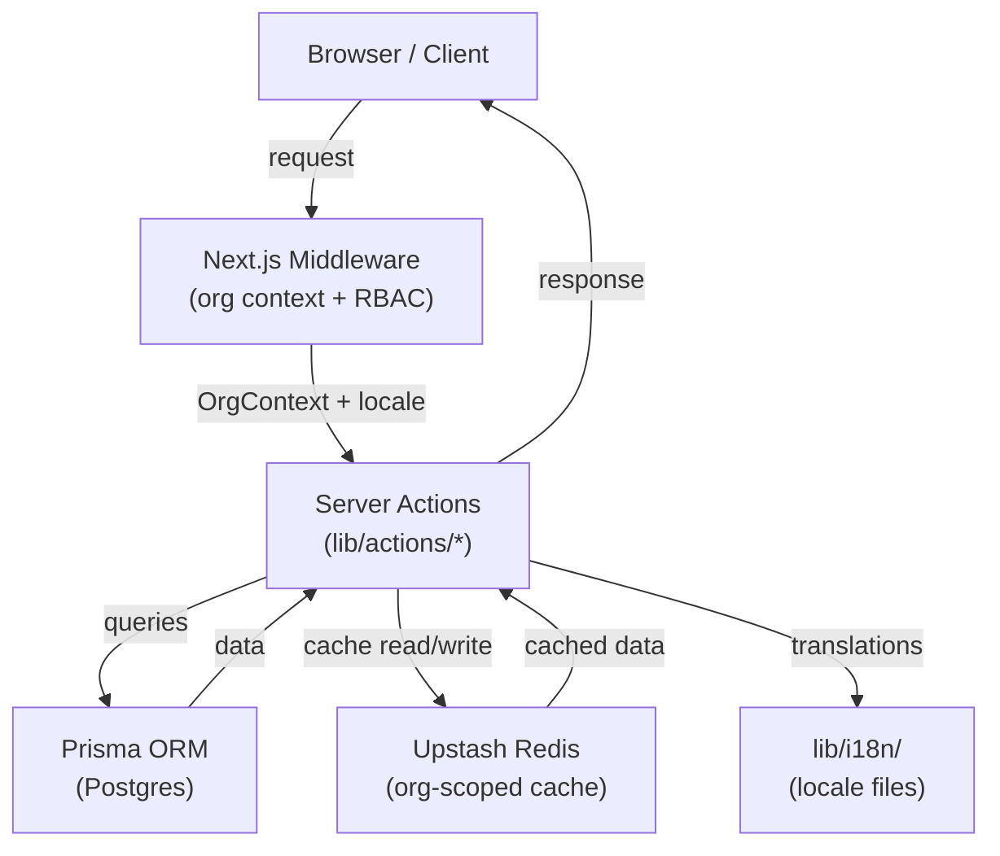

# Design Document: Inventory Enhancements

## Overview

This document describes the technical design for three capabilities added to the inventory management application:

1. **Mongolian (MN) Localization** — full UI translation and MNT currency formatting, with per-member language preference stored in the database.
2. **Smart Stock Alerts** — low-stock and anomaly-detection alerts, an alert bell in the sidebar, an alert history page, and dismiss actions.
3. **Gamification** — staff action tracking, a points system, a leaderboard, and badges.

All three features are org-scoped. Every piece of data is isolated to the requesting user's Organization via `getOrgContext()`. The implementation follows existing patterns: Redis caching with `org:{organizationId}:*` key namespacing, Prisma for persistence, and Server Actions for mutations.

**Key design decisions:**

| Decision | Rationale |
|---|---|
| `next-intl` for i18n | Provides server-component-compatible locale resolution, type-safe translation keys, and minimal bundle overhead. Locale files live in `lib/i18n/`. |
| `locale` field on `Member` | Keeps language preference org-scoped and avoids a separate user-preferences table. |
| Alert creation inside product server actions | Keeps alert logic co-located with the mutation that triggers it; no separate event bus needed at this scale. |
| Points computed from `StaffAction` counts | Avoids a mutable `points` column that can drift; the source of truth is always the action log. |
| Async action tracking (fire-and-forget) | `Promise.resolve().then(...)` pattern ensures `createProduct`/`updateProduct` are not blocked by leaderboard writes. |
| Badge evaluation on action recording | Simplest trigger point; badge checks are cheap (count queries, cached). |

---

## Architecture



### Request Lifecycle (with locale)

1. Request arrives at Next.js middleware.
2. Middleware resolves `OrgContext` via `getOrgContext()` (cached in Redis for 5 min).
3. `getOrgContext()` now also returns `locale` from the `Member` record (defaults to `en`).
4. Server components receive `locale` and pass it to `useTranslations` / `getTranslations`.
5. All Prisma queries are scoped with `where: { organizationId }`.
6. Cache keys use `org:{organizationId}:*` prefix.

### Async Action Tracking Pattern

```typescript
// Inside createProduct / updateProduct server actions
// Primary operation completes first
await prisma.product.create({ data: { ...parsed.data, organizationId } });

// Fire-and-forget — does NOT block the response
void trackStaffAction({
  memberId: ctx.memberId,
  organizationId: ctx.organizationId,
  type: "PRODUCT_CREATED",
}).catch(() => {}); // swallow errors — tracking must never break the primary flow
```

---

## Components and Interfaces

### `lib/i18n/` — Locale Files

```typescript
// lib/i18n/en.ts
export const en = {
  nav: {
    dashboard: "Dashboard",
    inventory: "Inventory",
    addProduct: "Add Product",
    alerts: "Alerts",
    leaderboard: "Leaderboard",
    settings: "Settings",
  },
  alerts: {
    title: "Alerts",
    lowStock: "Low Stock",
    anomaly: "Anomaly",
    unread: "Unread",
    dismissed: "Dismissed",
    dismissAll: "Dismiss All",
    noAlerts: "No alerts",
  },
  leaderboard: {
    title: "Leaderboard",
    rank: "Rank",
    member: "Member",
    points: "Points",
    badges: "Badges",
    yourRank: "Your Rank",
  },
  badges: {
    FIRST_PRODUCT: "First Product",
    HUNDRED_UPDATES: "100 Updates",
    TOP_PERFORMER: "Top Performer",
    INVENTORY_CHECKER: "Inventory Checker",
  },
  currency: {
    symbol: "",
    decimalPlaces: 2,
  },
  // ... additional keys
} as const;

export type TranslationKeys = typeof en;

// lib/i18n/mn.ts — mirrors the same shape with Mongolian strings
export const mn: TranslationKeys = {
  nav: {
    dashboard: "Хяналтын самбар",
    inventory: "Агуулах",
    addProduct: "Бараа нэмэх",
    alerts: "Мэдэгдэл",
    leaderboard: "Тэргүүлэгчид",
    settings: "Тохиргоо",
  },
  // ...
} as const;
```

### `lib/i18n/index.ts` — Translation Helper

```typescript
export type Locale = "en" | "mn";
export const SUPPORTED_LOCALES: Locale[] = ["en", "mn"];
export const DEFAULT_LOCALE: Locale = "en";

const locales = { en, mn };

/**
 * Returns the translation object for the given locale.
 * Falls back to 'en' for unrecognized locale values.
 */
export function getTranslations(locale: string): TranslationKeys {
  const resolved = SUPPORTED_LOCALES.includes(locale as Locale)
    ? (locale as Locale)
    : DEFAULT_LOCALE;
  return locales[resolved];
}

/**
 * Resolves a locale string to a supported Locale, defaulting to 'en'.
 */
export function resolveLocale(locale: string | null | undefined): Locale {
  if (locale && SUPPORTED_LOCALES.includes(locale as Locale)) {
    return locale as Locale;
  }
  return DEFAULT_LOCALE;
}
```

### `lib/i18n/currency.ts` — Currency Formatter

```typescript
/**
 * Formats a non-negative number into a locale-appropriate currency string.
 * Throws for negative values.
 */
export function formatCurrency(value: number, locale: Locale): string

/**
 * Parses a formatted MNT string (e.g. "₮12,500") back to a number.
 * Returns null if the string cannot be parsed.
 */
export function parseMNT(formatted: string): number | null
```

- `en`: `1234.56` → `"1234.56"` (two decimal places, no symbol)
- `mn`: `12500` → `"₮12,500"` (₮ prefix, comma thousands separator, no decimals)

### `lib/actions/locale.ts` — Locale Server Action

```typescript
/**
 * Persists the Member's language preference and invalidates their org context cache.
 */
export async function setLocale(locale: Locale): Promise<void>
```

### `lib/actions/alerts.ts` — Alert Server Actions

```typescript
/**
 * Returns paginated alerts for the org, ordered by createdAt desc.
 */
export async function getAlerts(page: number): Promise<{ alerts: Alert[]; total: number }>

/**
 * Returns the count of UNREAD alerts for the org (cached).
 */
export async function getUnreadAlertCount(): Promise<number>

/**
 * Dismisses a single alert. Returns not-found if alert is from another org.
 * Idempotent — dismissing an already-dismissed alert returns success.
 */
export async function dismissAlert(alertId: string): Promise<void>

/**
 * Dismisses all UNREAD alerts for the org in a single operation.
 */
export async function dismissAllAlerts(): Promise<void>
```

### `lib/actions/leaderboard.ts` — Leaderboard Server Actions

```typescript
/**
 * Returns the top 10 members by points, plus the requesting member's rank.
 * Cached under org:{organizationId}:leaderboard for 60s.
 */
export async function getLeaderboard(): Promise<LeaderboardData>

export interface LeaderboardEntry {
  memberId: string;
  displayName: string;
  points: number;
  rank: number;
  badges: BadgeType[];
  lastActionAt: Date | null;
}

export interface LeaderboardData {
  entries: LeaderboardEntry[];   // top 10
  selfEntry: LeaderboardEntry | null; // requesting member (null if in top 10)
}
```

### `lib/gamification/points.ts` — Points Calculator

```typescript
export const POINT_VALUES: Record<StaffActionType, number> = {
  PRODUCT_CREATED: 10,
  PRODUCT_UPDATED: 5,
  INVENTORY_CHECKED: 1,
};

/**
 * Computes total points from an array of StaffAction records.
 * Pure function — no DB access.
 */
export function calculatePoints(actions: Pick<StaffAction, "type">[]): number {
  return actions.reduce((sum, a) => sum + POINT_VALUES[a.type], 0);
}
```

### `lib/gamification/badges.ts` — Badge Evaluator

```typescript
export const BADGE_THRESHOLDS: Record<BadgeType, { actionType: StaffActionType; count: number } | null> = {
  FIRST_PRODUCT:      { actionType: "PRODUCT_CREATED",   count: 1   },
  HUNDRED_UPDATES:    { actionType: "PRODUCT_UPDATED",   count: 100 },
  INVENTORY_CHECKER:  { actionType: "INVENTORY_CHECKED", count: 50  },
  TOP_PERFORMER:      null, // evaluated separately at leaderboard recomputation
};

/**
 * Checks if a member qualifies for any new badges and creates them.
 * Called asynchronously after action tracking.
 */
export async function evaluateAndAwardBadges(
  memberId: string,
  organizationId: string,
  actionType: StaffActionType
): Promise<void>
```

### `lib/gamification/actions.ts` — Staff Action Tracker

```typescript
/**
 * Records a StaffAction and triggers async badge evaluation + cache invalidation.
 * Always resolves — errors are swallowed to protect the primary flow.
 */
export async function trackStaffAction(params: {
  memberId: string;
  organizationId: string;
  type: StaffActionType;
}): Promise<void>
```

### Updated `lib/org.ts` — OrgContext with locale

```typescript
export interface OrgContext {
  organizationId: string;
  memberId: string;       // NEW — needed for action tracking
  role: OrgRole;
  userId: string;
  orgName?: string;
  locale: Locale;         // NEW — resolved from Member.locale
}
```

### UI Components

| Component | Path | Description |
|---|---|---|
| `LanguageSwitcher` | `components/language-switcher.tsx` | Client component; calls `setLocale` server action on toggle |
| `AlertBell` | `components/alert-bell.tsx` | Server component; reads unread count from cache; shows badge |
| Updated `Sidebar` | `components/sidebar.tsx` | Adds `AlertBell`, `LanguageSwitcher`, Alerts and Leaderboard nav links |

### UI Pages

| Route | Component | Description |
|---|---|---|
| `/alerts` | `app/alerts/page.tsx` | Alert history with pagination and dismiss actions |
| `/leaderboard` | `app/leaderboard/page.tsx` | Top 10 + self rank + badges |

---

## Data Models

### Prisma Schema Additions

```prisma
// ─── New Enums ────────────────────────────────────────────────────────────────

enum Locale {
  en
  mn
}

enum AlertType {
  LOW_STOCK
  ANOMALY
}

enum AlertStatus {
  UNREAD
  DISMISSED
}

enum StaffActionType {
  PRODUCT_CREATED
  PRODUCT_UPDATED
  INVENTORY_CHECKED
}

enum BadgeType {
  FIRST_PRODUCT
  HUNDRED_UPDATES
  TOP_PERFORMER
  INVENTORY_CHECKER
}

// ─── Updated Member model ─────────────────────────────────────────────────────

model Member {
  id             String       @id @default(cuid())
  userId         String
  organizationId String
  role           Role
  locale         Locale       @default(en)   // NEW

  createdAt      DateTime     @default(now())
  updatedAt      DateTime     @updatedAt

  organization   Organization @relation(fields: [organizationId], references: [id], onDelete: Cascade)
  staffActions   StaffAction[]
  badges         Badge[]

  @@unique([userId, organizationId])
  @@index([organizationId])
  @@index([userId])
}

// ─── New Models ───────────────────────────────────────────────────────────────

model Alert {
  id             String       @id @default(cuid())
  organizationId String
  type           AlertType
  status         AlertStatus  @default(UNREAD)

  // Common fields
  productId      String
  productName    String
  createdAt      DateTime     @default(now())

  // LOW_STOCK fields
  currentQty     Int?
  lowStockAt     Int?

  // ANOMALY fields
  previousQty    Int?
  newQty         Int?
  percentageDrop Float?

  // Dismiss metadata
  dismissedById  String?      // Member.id
  dismissedAt    DateTime?

  organization   Organization @relation(fields: [organizationId], references: [id], onDelete: Cascade)

  @@index([organizationId, status])
  @@index([organizationId, productId, status])
  @@index([createdAt])
}

model StaffAction {
  id             String          @id @default(cuid())
  organizationId String
  memberId       String
  type           StaffActionType
  createdAt      DateTime        @default(now())

  organization   Organization    @relation(fields: [organizationId], references: [id], onDelete: Cascade)
  member         Member          @relation(fields: [memberId], references: [id], onDelete: Cascade)

  @@index([organizationId, memberId])
  @@index([organizationId, type])
  @@index([memberId, type])
}

model Badge {
  id             String       @id @default(cuid())
  organizationId String
  memberId       String
  type           BadgeType
  awardedAt      DateTime     @default(now())

  organization   Organization @relation(fields: [organizationId], references: [id], onDelete: Cascade)
  member         Member       @relation(fields: [memberId], references: [id], onDelete: Cascade)

  @@unique([memberId, organizationId, type])   // prevents duplicates
  @@index([organizationId, memberId])
}
```

### Cache Key Reference

| Key | TTL | Invalidated by |
|---|---|---|
| `org:{id}:alerts:unread_count` | 60s | Alert created, alert dismissed, bulk dismiss |
| `org:{id}:leaderboard` | 60s | StaffAction recorded, Badge awarded |
| `user:{userId}:orgContext` | 300s | Member locale updated |

### Alert Creation Logic (inside `updateProduct`)

```typescript
async function maybeCreateAlerts(
  organizationId: string,
  productId: string,
  productName: string,
  previousQty: number,
  newQty: number,
  lowStockAt: number | null
): Promise<void> {
  const tasks: Promise<unknown>[] = [];

  // Low stock check
  if (lowStockAt !== null && newQty <= lowStockAt) {
    tasks.push(
      prisma.alert.upsert({
        where: {
          // Use a unique index on (organizationId, productId, status=UNREAD, type=LOW_STOCK)
          // Implemented via findFirst + conditional create
        },
        // ...
      })
    );
  } else if (lowStockAt !== null && newQty > lowStockAt) {
    // Auto-dismiss existing UNREAD low stock alert
    tasks.push(
      prisma.alert.updateMany({
        where: { organizationId, productId, type: "LOW_STOCK", status: "UNREAD" },
        data: { status: "DISMISSED" },
      })
    );
  }

  // Anomaly check
  if (previousQty > 0 && newQty < previousQty) {
    const drop = (previousQty - newQty) / previousQty;
    if (drop > 0.5) {
      tasks.push(
        prisma.alert.create({
          data: {
            organizationId, type: "ANOMALY", productId, productName,
            previousQty, newQty, percentageDrop: drop * 100,
          },
        })
      );
    }
  }

  await Promise.all(tasks);

  if (tasks.length > 0) {
    await invalidateCache([`org:${organizationId}:alerts:unread_count`]);
  }
}
```

---

## Correctness Properties

*A property is a characteristic or behavior that should hold true across all valid executions of a system — essentially, a formal statement about what the system should do. Properties serve as the bridge between human-readable specifications and machine-verifiable correctness guarantees.*

### Property 1: Translation completeness

*For any* translation key defined in the English locale file and any supported locale (`en` or `mn`), calling `getTranslations(locale)[key]` SHALL return a non-empty string.

**Validates: Requirements 1.2, 1.3, 1.8**

---

### Property 2: Locale persistence round-trip

*For any* supported locale value `L`, after calling `setLocale(L)` for a member, resolving that member's locale from the database SHALL return `L`.

**Validates: Requirements 1.5, 1.6, 3.1**

---

### Property 3: Currency formatting is locale-appropriate

*For any* non-negative number `n` and locale `L`:
- When `L = "mn"`, `formatCurrency(n, L)` SHALL return a string beginning with `₮` and containing no decimal separator.
- When `L = "en"`, `formatCurrency(n, L)` SHALL return a string with exactly two decimal places and no `₮` symbol.

**Validates: Requirements 2.1, 2.2, 2.3**

---

### Property 4: MNT formatting round-trip

*For any* non-negative integer `n`, `parseMNT(formatCurrency(n, "mn"))` SHALL equal `n`.

**Validates: Requirements 2.4, 2.5**

---

### Property 5: Low stock alert creation with complete data

*For any* product with `lowStockAt` set to a non-null value, when the product's quantity is updated to a value at or below `lowStockAt`, the system SHALL create an `Alert` record of type `LOW_STOCK` with non-null values for `productId`, `productName`, `currentQty`, `lowStockAt`, `organizationId`, and `createdAt`.

**Validates: Requirements 4.1, 4.2, 4.3**

---

### Property 6: No duplicate low stock alerts

*For any* product that already has an `UNREAD` `LOW_STOCK` alert, triggering the low stock condition again SHALL NOT increase the count of `UNREAD` `LOW_STOCK` alerts for that product.

**Validates: Requirements 4.5**

---

### Property 7: Low stock alert auto-dismiss

*For any* product with an existing `UNREAD` `LOW_STOCK` alert, when the product's quantity is updated to a value strictly above `lowStockAt`, the alert's status SHALL be set to `DISMISSED`.

**Validates: Requirements 4.6**

---

### Property 8: Anomaly alert creation with complete data

*For any* product where `previousQty > 0` and `(previousQty - newQty) / previousQty > 0.5`, the system SHALL create an `Alert` record of type `ANOMALY` with non-null values for `productId`, `productName`, `previousQty`, `newQty`, `percentageDrop`, `organizationId`, and `createdAt`.

**Validates: Requirements 5.1, 5.2**

---

### Property 9: No anomaly alert on non-decreasing quantity

*For any* product where `newQty >= previousQty`, the system SHALL NOT create an `ANOMALY` alert regardless of the values involved.

**Validates: Requirements 5.4**

---

### Property 10: Points additive invariant

*For any* sequence of `StaffAction` records attributed to a member, `calculatePoints(actions)` SHALL equal `10 × (count of PRODUCT_CREATED) + 5 × (count of PRODUCT_UPDATED) + 1 × (count of INVENTORY_CHECKED)`.

**Validates: Requirements 10.1, 10.2, 10.3, 10.4, 10.5**

---

### Property 11: Leaderboard ranking correctness

*For any* set of members with computed points within an organization, the leaderboard SHALL return members in descending order of points, with no more than 10 entries.

**Validates: Requirements 11.2**

---

### Property 12: Leaderboard tie-breaking

*For any* two members with equal points totals, the member whose most recent `StaffAction` has an earlier `createdAt` timestamp SHALL be assigned the lower (better) rank number.

**Validates: Requirements 11.5**

---

### Property 13: Badge award idempotency

*For any* member who already holds a badge of type `T` within an organization, triggering the award condition for `T` again SHALL NOT create a second `Badge` record of type `T` for that member.

**Validates: Requirements 12.4**

---

### Property 14: Badge display completeness

*For any* member with `N` badges, the leaderboard entry for that member SHALL include all `N` badge types.

**Validates: Requirements 12.6**

---

### Property 15: Org-scoped query isolation

*For any* member of organization A, all query results for alerts, staff actions, leaderboard entries, and badges SHALL have `organizationId` equal to A's ID. No records from any other organization SHALL appear.

**Validates: Requirements 14.2**

---

### Property 16: Cross-org access returns not-found

*For any* alert, staff action, or badge record belonging to organization B, a member of organization A (where A ≠ B) attempting to read or mutate that record SHALL receive a not-found response that does not reveal the record's existence in another organization.

**Validates: Requirements 8.3, 14.3**

---

### Property 17: Cascade delete removes all org data

*For any* organization with associated alerts, staff actions, and badges, deleting the organization SHALL result in the deletion of all associated `Alert`, `StaffAction`, and `Badge` records.

**Validates: Requirements 14.4**

---

### Property 18: Cache key pattern compliance

*For any* cache operation introduced by this feature, the generated cache key SHALL match the pattern `org:{organizationId}:{feature}:{key}` where `organizationId` is the requesting member's organization ID.

**Validates: Requirements 6.4, 11.3, 13.1**

---

### Property 19: Cache invalidation on mutations

*For any* mutation that modifies alert or leaderboard data (alert created, alert dismissed, staff action recorded, badge awarded), the relevant cache key (`org:{organizationId}:alerts:unread_count` or `org:{organizationId}:leaderboard`) SHALL be invalidated using `invalidateCache`.

**Validates: Requirements 5.5, 6.5, 9.5, 12.5, 13.2**

---

## Error Handling

### Validation Errors
- `formatCurrency` called with a negative value → returns a descriptive error string (does not throw, to avoid crashing render paths)
- `setLocale` called with an unrecognized locale string → falls back to `en` and logs a warning; does not persist the invalid value
- Alert dismiss called with an invalid `alertId` format → returns validation error before DB query

### Not-Found Responses
- Alert, StaffAction, or Badge ID from another organization → 404 without revealing cross-org existence
- Product not found during alert creation → alert creation is skipped silently (product was deleted concurrently)

### Idempotency
- Dismissing an already-dismissed alert → returns success, no DB write
- Awarding a badge the member already holds → `upsert` with `@@unique` constraint prevents duplicates; no error surfaced

### Async Error Handling
- `trackStaffAction` wraps all DB writes in try/catch and swallows errors — tracking failures must never surface to the user
- `evaluateAndAwardBadges` follows the same pattern
- Alert creation inside `updateProduct` is synchronous (on the critical path for data integrity) but uses `Promise.all` to parallelize low-stock and anomaly checks

### Redis Unavailability
- All new cache reads use the existing `getCached` utility, which falls back to direct DB queries when Redis is unavailable
- Cache invalidation failures are swallowed (existing `invalidateCache` pattern)

### Locale Resolution Failures
- If `Member.locale` contains an unrecognized value (e.g., from a future migration), `resolveLocale` returns `"en"` and logs a warning
- This prevents a bad DB value from breaking the entire page render

---

## Testing Strategy

### Unit Tests (example-based)

Focus on specific behaviors and integration points:

- `formatCurrency(0, "mn")` → `"₮0"`
- `formatCurrency(12500, "mn")` → `"₮12,500"`
- `formatCurrency(1234.56, "en")` → `"1234.56"`
- `parseMNT("₮12,500")` → `12500`
- `parseMNT("invalid")` → `null`
- `resolveLocale(null)` → `"en"`
- `resolveLocale("fr")` → `"en"` (unsupported locale fallback)
- `calculatePoints([])` → `0`
- Alert creation: product with `lowStockAt = null` → no alert created
- Alert creation: previous quantity = 0 → no anomaly alert
- Dismiss alert: already dismissed → success, no DB write
- Bulk dismiss: 0 UNREAD alerts → success, no DB write
- Leaderboard: fewer than 10 members → returns all members
- `selfEntry` is `null` when requesting member is in top 10

### Property-Based Tests

Use [fast-check](https://github.com/dubzzz/fast-check) for TypeScript property-based testing. Each test runs a minimum of 100 iterations.

**Configuration:**
```typescript
// Tag format for each property test:
// Feature: inventory-enhancements, Property {N}: {property_text}
import fc from "fast-check";
```

| Property | Generator | Assertion |
|---|---|---|
| P1: Translation completeness | `fc.constantFrom(...Object.keys(en))`, `fc.constantFrom("en", "mn")` | `getTranslations(locale)[key]` is a non-empty string |
| P2: Locale persistence round-trip | `fc.constantFrom("en", "mn")` | After `setLocale(L)`, DB read returns `L` |
| P3: Currency formatting | `fc.float({ min: 0, max: 1e9, noNaN: true })`, `fc.constantFrom("en", "mn")` | mn: starts with ₮, no decimal; en: exactly 2 decimal places |
| P4: MNT round-trip | `fc.integer({ min: 0, max: 1e9 })` | `parseMNT(formatCurrency(n, "mn")) === n` |
| P5: Low stock alert creation | `fc.record({ qty: fc.integer({min:0}), lowStockAt: fc.integer({min:1}) })` where `qty <= lowStockAt` | Alert created with all required fields non-null |
| P6: No duplicate low stock alerts | Product with existing UNREAD alert, `fc.integer({min:0})` qty ≤ lowStockAt | Alert count unchanged |
| P7: Low stock auto-dismiss | Product with UNREAD alert, `fc.integer({min:1})` qty > lowStockAt | Alert status = DISMISSED |
| P8: Anomaly alert creation | `fc.integer({min:1})` prevQty, `fc.float({min:0, max:0.49})` ratio → newQty = prevQty * ratio | Alert created with all required fields non-null |
| P9: No anomaly on non-decrease | `fc.integer({min:0})` prevQty, `fc.integer({min:0})` newQty where newQty >= prevQty | No ANOMALY alert created |
| P10: Points additive invariant | `fc.array(fc.constantFrom("PRODUCT_CREATED","PRODUCT_UPDATED","INVENTORY_CHECKED"))` | `calculatePoints(actions) === 10*c + 5*u + 1*i` |
| P11: Leaderboard ranking | `fc.array(fc.record({points: fc.integer({min:0})}), {minLength:1, maxLength:20})` | Results ≤ 10, sorted descending by points |
| P12: Tie-breaking | Two members with equal points, different `lastActionAt` | Earlier `lastActionAt` → lower rank number |
| P13: Badge idempotency | Member with existing badge of type T | Triggering award condition → badge count unchanged |
| P14: Badge display | Member with `fc.array(fc.constantFrom(...BadgeType))` badges | Leaderboard entry includes all badge types |
| P15: Org-scoped isolation | Two orgs with data, `fc.constantFrom(orgA, orgB)` member | All results have correct `organizationId` |
| P16: Cross-org not-found | Record from org B, member from org A | Response is not-found |
| P17: Cascade delete | Org with alerts/actions/badges | After org delete, all associated records gone |
| P18: Cache key pattern | `fc.string()` organizationId, feature, key | Generated key matches `org:{id}:{feature}:{key}` |
| P19: Cache invalidation | Any mutation (dismiss, track action, award badge) | Relevant cache key invalidated via `invalidateCache` |

### Integration Tests

- `updateProduct` with quantity below `lowStockAt` → alert created in DB
- `updateProduct` with quantity above `lowStockAt` → existing UNREAD alert dismissed
- `createProduct` → `StaffAction` of type `PRODUCT_CREATED` recorded asynchronously
- `getLeaderboard` with Redis unavailable → falls back to DB query, returns correct data
- `dismissAllAlerts` → all UNREAD alerts set to DISMISSED, cache invalidated
- `TOP_PERFORMER` badge awarded to member with highest points at leaderboard recomputation
- Deleting an organization cascades to all Alert, StaffAction, Badge records
