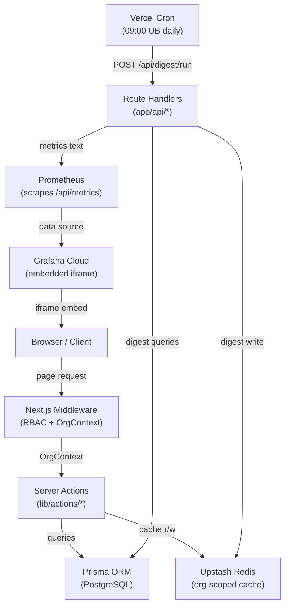

# Design Document: StockFlow Advanced Features

## Overview

This document describes the technical design for six advanced features added to StockFlow:

1. **Server Monitoring Dashboard** (SUPER_ADMIN) — Prometheus metrics endpoint + Grafana-embedded dashboard at `/admin/monitoring`.
2. **Audit Trail** (MANAGER) — `AuditLog` Prisma model, server actions, and `/org/audit` page with filtering and cursor-based pagination.
3. **Multi-Currency Support** (MANAGER) — Seven currency codes stored on `Organization`, a new `formatCurrencyByCode` formatter, and org settings UI.
4. **Daily Standup Digest** (MANAGER) — Vercel Cron job at 09:00 UB time, Redis-cached `DigestReport`, and a dashboard card.
5. **Product Image Gallery View** (All roles) — Toggle between `TableView` and `GalleryView` in the inventory toolbar, with `localStorage` persistence.
6. **Keyboard Shortcuts** (All roles) — Global `keydown` listener, shortcut reference panel, and accessibility compliance.

All features follow existing patterns: `getOrgContext()` for auth/RBAC, `org:{organizationId}:*` Redis key namespacing, Prisma for persistence, and Server Actions for mutations.

**Key design decisions:**

| Decision | Rationale |
|---|---|
| `prom-client` for Prometheus metrics | Industry-standard Node.js library; integrates cleanly with Next.js Route Handlers. |
| `METRICS_SECRET` bearer token auth | Simple, stateless protection for the scrape endpoint without adding OAuth complexity. |
| `AuditLog` as a separate model (not reusing `StaffAction`) | `StaffAction` is gamification-scoped; `AuditLog` is compliance-scoped with richer before/after JSON snapshots. |
| Cursor-based pagination for audit log | Offset pagination degrades at >1000 rows; cursor on `(createdAt, id)` keeps queries O(log n). |
| Currency stored as `String` on `Organization` | Avoids a new enum migration for each new currency; validated at the application layer with a `SUPPORTED_CURRENCIES` constant. |
| Vercel Cron + Route Handler for digest | No external scheduler needed; Vercel Cron triggers a protected `/api/digest/run` endpoint. |
| `localStorage` for gallery view preference | Lightweight, no server round-trip needed; preference is purely cosmetic. |
| Single global `useKeyboardShortcuts` hook | Centralizes listener registration/cleanup; prevents duplicate listeners across re-renders. |

---

## Architecture



### Request Lifecycle

1. Request hits Next.js middleware; `getOrgContext()` resolves org + role (Redis-cached 5 min).
2. RBAC is enforced via `requireRole(ctx, "MANAGER")` or `requireRole(ctx, "SUPER_ADMIN")` at the top of each page/action.
3. All Prisma queries are scoped with `where: { organizationId: ctx.organizationId }`.
4. Mutations invalidate relevant `org:{organizationId}:*` cache keys.

---

## Components and Interfaces

### Feature 1: Server Monitoring Dashboard

#### `/api/metrics` Route Handler

```typescript
// app/api/metrics/route.ts
import { register, collectDefaultMetrics, Counter, Histogram, Gauge } from "prom-client";

collectDefaultMetrics(); // process memory, CPU, event loop lag

export const httpRequestCount = new Counter({
  name: "http_requests_total",
  help: "Total HTTP requests",
  labelNames: ["route", "status_code"],
});

export const httpRequestDuration = new Histogram({
  name: "http_request_duration_ms",
  help: "HTTP request duration in milliseconds",
  labelNames: ["route"],
  buckets: [10, 50, 100, 200, 500, 1000],
});

export const dbConnectionCount = new Gauge({
  name: "db_connections_active",
  help: "Active database connections",
});

export const redisCacheHitRate = new Gauge({
  name: "redis_cache_hit_rate",
  help: "Redis cache hit rate (0-1)",
});

export const memoryUsageMb = new Gauge({
  name: "memory_usage_mb",
  help: "Current memory usage in megabytes",
});

export async function GET(request: Request) {
  const auth = request.headers.get("Authorization");
  if (auth !== `Bearer ${process.env.METRICS_SECRET}`) {
    return new Response("Unauthorized", { status: 401 });
  }
  const metrics = await register.metrics();
  return new Response(metrics, {
    headers: { "Content-Type": register.contentType },
  });
}
```

#### `/admin/monitoring` Page

```typescript
// app/admin/monitoring/page.tsx
export default async function MonitoringPage() {
  const ctx = await getOrgContext();
  requireRole(ctx, "SUPER_ADMIN");
  // Renders GrafanaEmbed client component
}
```

#### `GrafanaEmbed` Client Component

```typescript
// components/grafana-embed.tsx — client component
// Renders an <iframe> pointing to NEXT_PUBLIC_GRAFANA_EMBED_URL
// Shows skeleton while loading (onLoad not yet fired)
// Shows "Monitoring unavailable" + retry button on iframe error
```

---

### Feature 2: Audit Trail

#### `AuditLog` Server Actions

```typescript
// lib/actions/audit.ts

export type AuditActionType = "CREATE" | "UPDATE" | "DELETE" | "ROLE_CHANGE" | "MEMBERSHIP";
export type AuditEntityType = "Product" | "Member" | "Invitation";

export interface AuditLogEntry {
  id: string;
  organizationId: string;
  actorMemberId: string;
  actorDisplayName: string;
  actionType: AuditActionType;
  entityType: AuditEntityType;
  entityId: string;
  entityName: string;
  before: Record<string, unknown> | null;
  after: Record<string, unknown> | null;
  createdAt: Date;
}

/**
 * Writes an AuditLog entry. Fire-and-forget safe — errors are logged but
 * never propagate to the caller.
 */
export async function writeAuditLog(entry: Omit<AuditLogEntry, "id" | "createdAt">): Promise<void>

/**
 * Returns paginated audit log entries for the org, newest first.
 * Uses cursor-based pagination on (createdAt DESC, id DESC).
 */
export async function getAuditLogs(params: {
  organizationId: string;
  cursor?: string;        // AuditLog.id of last seen entry
  limit?: number;         // default 50
  actorMemberId?: string;
  actionType?: AuditActionType;
  entityType?: AuditEntityType;
  dateFrom?: Date;
  dateTo?: Date;
}): Promise<{ entries: AuditLogEntry[]; nextCursor: string | null }>
```

#### Integration Points

`writeAuditLog` is called (fire-and-forget) from:
- `createProduct`, `updateProduct`, `deleteProduct` in `lib/actions/products.ts`
- `updateMemberRole`, `removeMember`, `inviteMember` in `lib/actions/membership.ts`

---

### Feature 3: Multi-Currency Support

#### `lib/i18n/currency.ts` — Extended Formatter

```typescript
export const SUPPORTED_CURRENCIES = ["MNT", "USD", "EUR", "CNY", "JPY", "KRW", "GBP"] as const;
export type CurrencyCode = typeof SUPPORTED_CURRENCIES[number];

export interface CurrencyFormat {
  symbol: string;
  decimals: number;
  symbolPosition: "prefix" | "suffix";
  thousandsSep: string;
  decimalSep: string;
}

export const CURRENCY_FORMATS: Record<CurrencyCode, CurrencyFormat> = {
  MNT: { symbol: "₮", decimals: 0, symbolPosition: "prefix", thousandsSep: ",", decimalSep: "." },
  USD: { symbol: "$", decimals: 2, symbolPosition: "prefix", thousandsSep: ",", decimalSep: "." },
  EUR: { symbol: "€", decimals: 2, symbolPosition: "prefix", thousandsSep: ",", decimalSep: "." },
  CNY: { symbol: "¥", decimals: 2, symbolPosition: "prefix", thousandsSep: ",", decimalSep: "." },
  JPY: { symbol: "¥", decimals: 0, symbolPosition: "prefix", thousandsSep: ",", decimalSep: "." },
  KRW: { symbol: "₩", decimals: 0, symbolPosition: "prefix", thousandsSep: ",", decimalSep: "." },
  GBP: { symbol: "£", decimals: 2, symbolPosition: "prefix", thousandsSep: ",", decimalSep: "." },
};

/**
 * Formats a non-negative number using the given currency code.
 * Throws if currencyCode is not in SUPPORTED_CURRENCIES.
 */
export function formatCurrencyByCode(value: number, currencyCode: CurrencyCode): string

/**
 * Parses a formatted currency string back to a number.
 * Returns null if the string cannot be parsed.
 */
export function parseCurrencyString(formatted: string, currencyCode: CurrencyCode): number | null
```

#### Org Settings Currency Section

A new "Display Currency" card is added to `/org/settings` with a `<select>` of the 7 supported codes. The `updateOrgCurrency` server action validates the code against `SUPPORTED_CURRENCIES` and persists it to `Organization.currency`.

---

### Feature 4: Daily Standup Digest

#### Vercel Cron Configuration

```json
// vercel.json (addition)
{
  "crons": [
    {
      "path": "/api/digest/run",
      "schedule": "0 1 * * *"
    }
  ]
}
```

`0 1 * * *` = 01:00 UTC = 09:00 Ulaanbaatar (UTC+8).

#### `/api/digest/run` Route Handler

```typescript
// app/api/digest/run/route.ts
// Protected by CRON_SECRET header (Vercel sets this automatically)
// Iterates all organizations, computes DigestReport, stores in Redis
// On failure: logs error, retries once after 5 minutes via setTimeout
```

#### DigestReport Shape

```typescript
export interface DigestReport {
  organizationId: string;
  date: string;                // "YYYY-MM-DD" in Ulaanbaatar time
  totalInventoryValue: number; // in org's currency
  currencyCode: string;
  newProductsCount: number;
  dispatchCount: number;
  newAlertsCount: number;
  dismissedAlertsCount: number;
  computedAt: string;          // ISO timestamp
}
```

Redis key: `org:{organizationId}:digest:latest` — TTL 48 hours.

#### Dashboard Card

A `DigestCard` server component is added to `/dashboard`. It reads from Redis and renders the summary. Visible only to MANAGER and SUPER_ADMIN roles.

---

### Feature 5: Product Image Gallery View

#### `useViewPreference` Hook

```typescript
// lib/hooks/use-view-preference.ts
export type ViewMode = "table" | "gallery";

export function useViewPreference(key = "inventory-view"): [ViewMode, (v: ViewMode) => void]
// Reads/writes localStorage["inventory-view"]
// Defaults to "table" if no preference stored
```

#### `GalleryView` Component

```typescript
// components/gallery-view.tsx — client component
interface GalleryViewProps {
  items: Product[];
  onAdjust: (id: string, delta: number) => void;
  onDelete: (id: string) => void;
}
// Renders a CSS grid: 1 col <640px, 2 cols 640-1023px, 4 cols ≥1024px
// Each card: image (or placeholder icon), name, SKU, quantity, status badge
// Card click → router.push(`/add-product?id=${product.id}`)
```

#### Updated `InventoryClient`

A toggle button (table/gallery icon) is added to the toolbar. The active `ViewMode` from `useViewPreference` determines whether `InventoryTable` or `GalleryView` is rendered. All filter/pagination state is shared between both views.

---

### Feature 6: Keyboard Shortcuts

#### `useKeyboardShortcuts` Hook

```typescript
// lib/hooks/use-keyboard-shortcuts.ts
export interface ShortcutDefinition {
  key: string;           // e.g. "n", "d", "a", "`", "?"
  description: string;
  action: () => void;
}

export function useKeyboardShortcuts(shortcuts: ShortcutDefinition[]): void
// Registers a single keydown listener on document
// Skips if event.target is INPUT, TEXTAREA, or contenteditable
// Falls back to event.keyCode if event.key is undefined
// Cleans up listener on unmount
```

#### `KeyboardShortcutPanel` Component

```typescript
// components/keyboard-shortcut-panel.tsx — client component
// role="dialog", aria-modal="true", aria-label="Keyboard shortcuts"
// Visible close button + Escape key closes
// Renders a table of all registered shortcuts
```

#### Global Registration

The hook and panel are mounted in `app/layout.tsx` (or a `GlobalShortcuts` client component rendered there) so shortcuts are available on every page.

**Shortcut map:**

| Key | Action |
|---|---|
| `N` | `router.push("/add-product")` |
| `D` | `router.push("/dispatch")` |
| `A` | `router.push("/alerts")` |
| `` ` `` | Focus `#inventory-search` input |
| `?` | Open shortcut reference panel |

---

## Data Models

### Prisma Schema Additions

```prisma
// ─── New Enum ─────────────────────────────────────────────────────────────────

enum AuditActionType {
  CREATE
  UPDATE
  DELETE
  ROLE_CHANGE
  MEMBERSHIP
}

// ─── Updated Organization model ───────────────────────────────────────────────

model Organization {
  // ... existing fields ...
  currency    String   @default("MNT")  // NEW: CurrencyCode stored as string

  auditLogs   AuditLog[]
}

// ─── New AuditLog model ───────────────────────────────────────────────────────

model AuditLog {
  id              String          @id @default(cuid())
  organizationId  String
  actorMemberId   String
  actorDisplayName String
  actionType      AuditActionType
  entityType      String          // "Product" | "Member" | "Invitation"
  entityId        String
  entityName      String
  before          Json?           // snapshot of changed fields before
  after           Json?           // snapshot of changed fields after
  createdAt       DateTime        @default(now())

  organization    Organization    @relation(fields: [organizationId], references: [id], onDelete: Cascade)

  @@index([organizationId, createdAt(sort: Desc)])
  @@index([organizationId, actorMemberId])
  @@index([organizationId, actionType])
  @@index([organizationId, entityType])
}
```

### Cache Key Reference

| Key | TTL | Invalidated by |
|---|---|---|
| `org:{id}:digest:latest` | 48h | Digest scheduler run |
| `org:{id}:dashboard` | 300s | Product mutations (existing) |
| `user:{userId}:orgContext` | 300s | Currency change (org context includes currency) |

### Sidebar Navigation Additions

| Route | Role | Label |
|---|---|---|
| `/org/audit` | MANAGER+ | Audit Log |
| `/admin/monitoring` | SUPER_ADMIN | Monitoring |

---

## Correctness Properties

*A property is a characteristic or behavior that should hold true across all valid executions of a system — essentially, a formal statement about what the system should do. Properties serve as the bridge between human-readable specifications and machine-verifiable correctness guarantees.*

### Property 1: Metrics output contains all required metric names

*For any* set of recorded metric values, the Prometheus text output from `/api/metrics` SHALL contain all five required metric names: `http_requests_total`, `http_request_duration_ms`, `db_connections_active`, `redis_cache_hit_rate`, and `memory_usage_mb`.

**Validates: Requirements 1.3**

---

### Property 2: AuditLog entry completeness on product mutation

*For any* product create, update, or delete operation performed by any member, the resulting `AuditLog` entry SHALL have non-null values for `actorMemberId`, `actorDisplayName`, `organizationId`, `actionType`, `entityType`, `entityId`, `entityName`, and `createdAt`.

**Validates: Requirements 2.1, 2.2**

---

### Property 3: Audit log entries are returned in reverse-chronological order

*For any* collection of `AuditLog` entries for an organization, the entries returned by `getAuditLogs` SHALL be ordered by `createdAt` descending — no entry in the result set SHALL have a `createdAt` timestamp later than the entry before it.

**Validates: Requirements 2.3**

---

### Property 4: Audit log filter correctness

*For any* filter combination (actor, action type, entity type, date range) applied to any set of audit log entries, every entry in the returned result SHALL satisfy all active filter criteria simultaneously.

**Validates: Requirements 2.4**

---

### Property 5: Currency formatting correctness by code

*For any* non-negative number and any supported currency code, `formatCurrencyByCode(value, code)` SHALL return a string that:
- Starts with the correct symbol for that currency code
- Contains no decimal point when `decimals === 0` (MNT, JPY, KRW)
- Contains exactly two decimal places when `decimals === 2` (USD, EUR, CNY, GBP)

**Validates: Requirements 3.3, 3.4, 3.5, 3.6**

---

### Property 6: Currency formatting round-trip

*For any* non-negative number `n` and any supported currency code, `parseCurrencyString(formatCurrencyByCode(n, code), code)` SHALL equal `n` (within floating-point precision for decimal currencies).

**Validates: Requirements 3.8**

---

### Property 7: Unsupported currency codes are rejected

*For any* string that is not a member of `SUPPORTED_CURRENCIES`, submitting it as a currency selection SHALL result in a validation error and the `Organization.currency` field SHALL remain unchanged.

**Validates: Requirements 3.7**

---

### Property 8: Currency persistence round-trip

*For any* supported currency code `C`, after a MANAGER saves `C` via `updateOrgCurrency`, reading the organization record from the database SHALL return `currency === C`.

**Validates: Requirements 3.2**

---

### Property 9: DigestReport contains all required fields

*For any* organization with activity data for the previous calendar day, the computed `DigestReport` SHALL have non-null values for `totalInventoryValue`, `currencyCode`, `newProductsCount`, `dispatchCount`, `newAlertsCount`, `dismissedAlertsCount`, and `date`.

**Validates: Requirements 4.2**

---

### Property 10: Digest card visibility matches role

*For any* member, the digest card on the dashboard SHALL be visible if and only if the member's role is `MANAGER` or `SUPER_ADMIN`.

**Validates: Requirements 4.7**

---

### Property 11: Gallery view toggle is a round-trip

*For any* inventory state (search query, filter, page), toggling from `TableView` to `GalleryView` and back to `TableView` SHALL restore the original view with the same products, filters, and pagination state.

**Validates: Requirements 5.2, 5.3, 5.5**

---

### Property 12: Gallery card contains all required display fields

*For any* product, the rendered gallery card SHALL include the product name, current quantity, and stock status badge. If `imageUrl` is non-null it SHALL render the image; if `imageUrl` is null it SHALL render a placeholder.

**Validates: Requirements 5.4, 5.7**

---

### Property 13: View preference localStorage round-trip

*For any* view mode value (`"table"` or `"gallery"`), writing the preference via `useViewPreference` and then reading it back SHALL return the same value.

**Validates: Requirements 5.8**

---

### Property 14: Keyboard shortcuts fire only when no input is focused

*For any* defined shortcut key, pressing that key while a text input, textarea, or contenteditable element is focused SHALL NOT trigger the shortcut action.

**Validates: Requirements 6.3**

---

### Property 15: Keyboard shortcut listener lifecycle

*For any* mount/unmount cycle of the component that registers keyboard shortcuts, the `keydown` event listener SHALL be added to `document` on mount and removed from `document` on unmount — resulting in zero net listeners after unmount.

**Validates: Requirements 6.6**

---

## Error Handling

### Metrics Endpoint
- Missing or invalid `METRICS_SECRET` → 401, no metrics exposed.
- `prom-client` collection error → 500 with generic message; never exposes internal stack traces.

### Audit Trail
- `writeAuditLog` failure → error logged to server console; originating operation (product mutation, membership change) is NOT rolled back. This is intentional — audit failures must not block business operations.
- Invalid cursor in `getAuditLogs` → treated as "start from beginning"; no error surfaced to user.

### Multi-Currency
- `formatCurrencyByCode` called with unsupported code → throws `Error("Unsupported currency: X")`; callers must validate before calling.
- `updateOrgCurrency` with unsupported code → Zod validation rejects before DB write; returns user-facing error message.
- Negative value passed to `formatCurrencyByCode` → returns `"Invalid amount"` (consistent with existing `formatCurrency` behavior).

### Daily Digest
- Scheduler failure → error logged; single retry after 5 minutes via a delayed re-invocation of the compute function.
- Redis write failure during digest store → error logged; digest is not stored; next run will overwrite.
- Organization with no activity → DigestReport is still written with zero counts; no error.

### Gallery View
- `localStorage` unavailable (SSR, private browsing) → `useViewPreference` catches the exception and defaults to `"table"`.
- Product with broken `imageUrl` → `` `onError` handler swaps to placeholder icon.

### Keyboard Shortcuts
- `KeyboardEvent.key` undefined → falls back to `KeyboardEvent.keyCode` mapping.
- Shortcut action throws → error is caught and logged; does not crash the page.

---

## Testing Strategy

### Unit Tests (example-based)

- `formatCurrencyByCode(12500, "MNT")` → `"₮12,500"`
- `formatCurrencyByCode(1234.56, "USD")` → `"$1,234.56"`
- `formatCurrencyByCode(1234.56, "EUR")` → `"€1,234.56"`
- `formatCurrencyByCode(0, "JPY")` → `"¥0"`
- `parseCurrencyString("₮12,500", "MNT")` → `12500`
- `parseCurrencyString("$1,234.56", "USD")` → `1234.56`
- `parseCurrencyString("invalid", "USD")` → `null`
- `formatCurrencyByCode(-1, "USD")` → `"Invalid amount"`
- `getAuditLogs` with no filters → returns entries sorted by `createdAt` desc
- `getAuditLogs` with `actorMemberId` filter → returns only entries for that actor
- `writeAuditLog` DB failure → does not throw; logs error
- `useViewPreference` with no localStorage entry → returns `"table"`
- `useViewPreference` with `"gallery"` stored → returns `"gallery"`
- Keyboard shortcut: key pressed while `<input>` focused → action not called
- Keyboard shortcut: key pressed while no input focused → action called
- `DigestReport` with zero activity → all count fields are `0`, not `null`

### Property-Based Tests

Use [fast-check](https://github.com/dubzzz/fast-check). Each test runs a minimum of 100 iterations.

Tag format: `Feature: stockflow-advanced-features, Property {N}: {property_text}`

| Property | Generator | Assertion |
|---|---|---|
| P1: Metrics output completeness | `fc.record({ requests: fc.nat(), duration: fc.float({min:0}) })` | Output string contains all 5 metric names |
| P2: AuditLog entry completeness | `fc.record({ actionType: fc.constantFrom("CREATE","UPDATE","DELETE"), ... })` | All required fields non-null |
| P3: Audit log ordering | `fc.array(fc.record({ createdAt: fc.date() }), {minLength:2})` | Result sorted by `createdAt` desc |
| P4: Audit log filter correctness | `fc.record({ filter: fc.constantFrom("actor","actionType","entityType"), value: fc.string() })` | All results match filter |
| P5: Currency formatting correctness | `fc.float({min:0, max:1e9, noNaN:true})`, `fc.constantFrom(...SUPPORTED_CURRENCIES)` | Correct symbol, correct decimal count |
| P6: Currency round-trip | `fc.integer({min:0, max:1e9})`, `fc.constantFrom(...SUPPORTED_CURRENCIES)` | `parse(format(n, code)) === n` |
| P7: Unsupported currency rejection | `fc.string().filter(s => !SUPPORTED_CURRENCIES.includes(s))` | Validation error, org record unchanged |
| P8: Currency persistence round-trip | `fc.constantFrom(...SUPPORTED_CURRENCIES)` | DB read after save returns same code |
| P9: DigestReport field completeness | `fc.record({ orgId: fc.string(), activityData: ... })` | All required fields non-null |
| P10: Digest card role visibility | `fc.constantFrom("STAFF","MANAGER","SUPER_ADMIN")` | Card visible iff role is MANAGER or SUPER_ADMIN |
| P11: Gallery toggle round-trip | `fc.record({ q: fc.string(), filter: fc.string(), page: fc.nat() })` | State preserved after table→gallery→table |
| P12: Gallery card display fields | `fc.record({ name: fc.string(), quantity: fc.nat(), imageUrl: fc.option(fc.webUrl()) })` | Card contains name, quantity, status badge, image or placeholder |
| P13: View preference round-trip | `fc.constantFrom("table", "gallery")` | `read(write(v)) === v` |
| P14: Shortcuts blocked when input focused | `fc.constantFrom("n","d","a","`","?")`, `fc.constantFrom("INPUT","TEXTAREA")` | Action not called |
| P15: Listener lifecycle | Mount/unmount cycle | Zero net listeners after unmount |

### Integration Tests

- `GET /api/metrics` without `Authorization` header → 401
- `GET /api/metrics` with valid `METRICS_SECRET` → 200, Prometheus text format
- `GET /admin/monitoring` as STAFF → 403 redirect
- `GET /admin/monitoring` as SUPER_ADMIN → 200
- `POST /api/digest/run` without `CRON_SECRET` → 401
- `POST /api/digest/run` with valid secret → 200, digest stored in Redis
- `GET /org/audit` as STAFF → 403 redirect
- `GET /org/audit` as MANAGER → 200, entries in reverse-chronological order
- `updateOrgCurrency("XYZ")` → validation error, org unchanged
- `updateOrgCurrency("EUR")` → org.currency === "EUR", Redis cache invalidated
- Product create → AuditLog entry written with `actionType: "CREATE"`
- Product delete → AuditLog entry written with `actionType: "DELETE"`
